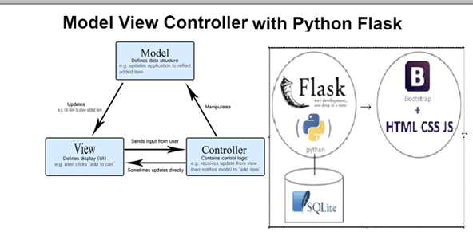

# Model View Controller (MVC) with Python Flask
## Python Flask

- Flask is a python micro-framework
```python
# creating a file called app.py
# Let's see how can we use Python Flask to interact with our browser
# Install flask:
# pip install flask

from flask import Flask

# we have to create an object of this class
app = Flask(__name__) #creating an app instance

# Let's create a function to link to our home/default page
# Let's connect this function to our browser
@app.route("/") # decorating our function with @app.route to set route in our browser
def index():
    return " Welcome to Engineering 89 DevOps team "

# flask run (from the terminal)

# Let's create a welcome page
@app.route("/welcome/") # '/' at the end -> is the best practice to have as it would load the page in both cases
def welcome():
    return "<h1> Welcome page for  Flask app </h1>"

# create a decorator to route traffic to login page
# display 2 messages of your choice in form of h1 and h2
@app.route("/login/")
def login():
    return "<h1> Welcome to the login page </h1>" \
           "<h2> Keep your credentials ready to login <h2> "

```
## HTML

## CSS

## JS

## BootStrap